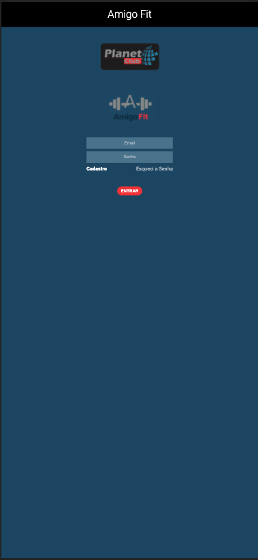
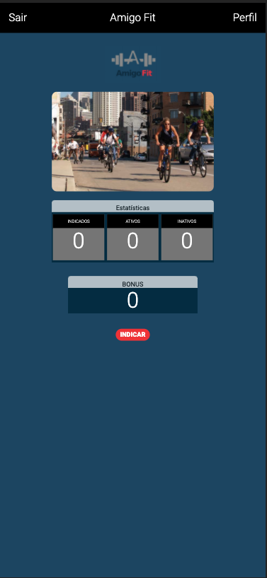
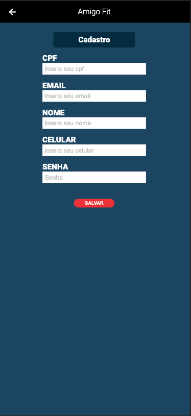

# Amigo Fit
A Small project with HTML + CSS + JS for riders

## Installation instructions

These instructions will help you install the app on your local machine.

#### Prerequisites

Make sure you have Git and Node installed, before you proceed.

#### 1. Clone the amigo-fit app repositors to your local machine

To clone and run this application, you will need Git installed on your computer.

`$ git clone https://github.com/diogenesdauster/amigo-fit.git`

#### 2. Run "npm install" in your local repository's folder

To install dependencies, from within the both project directorys:

`$ npm install` or `$ yarn install`

#### 3. Start the amigo-fit app with "npm start"

To begin the server run :

`$ npm start` or `$ yarn start`

#### 4. Open your browser at http://localhost:3000/

## ScreenShots
| Login        | Home           | Cadastro  |
| ------------- |-------------| -----|
||||

## Todo
- Html ✅
- Css ✅ 
- Express ✅
- Ejs ✅
- Input Validation
- Input Mask
- Api
- JWT Login
- React
